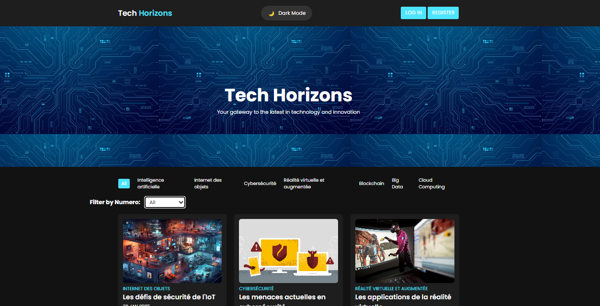

# WEB-SITE-Tech-Horizons
 # Tech Horizons - Online Magazine Management

## Contributors

| Contributor          | Photo |
|----------------------|-------|
| **Wail Chairi Mahjor**  |  |
| **Abderrahmane Hafdane** |  |
| **Yassir Aharroun**      |  |

## Project Overview

Tech Horizons is a web application designed to manage an online magazine. It provides an intuitive and secure platform for users to explore cutting-edge technological innovations, such as Artificial Intelligence, IoT, Cybersecurity, Virtual and Augmented Reality, and more.

The application supports four user roles:
- **Guest**: View theme information, request subscription, and access public issues.
- **Subscriber**: Manage subscriptions, browse issues, track history, rate articles, and suggest publications.
- **Theme Manager**: Manage theme-related subscriptions, approve articles, and analyze statistics.
- **Editor**: Manage magazine issues, activate/deactivate articles, and oversee user statistics.

## Technologies Used

- PHP
- MySQL
- HTML, CSS, JavaScript
- Laravel Framework

## Supervised By

- Pr. M'hamed AIT KBIR  
- Pr. Yasyn EL YUSUFI

## Academic Year

2024/2025

## Welcome Page Preview

---

**Created by:**  
Wail Chairi Mahjor, Abderrahmane Hafdane, Yassir Aharroun

        
Created by Wail Chairi, Abderrahmane Hafdane, Yassir Aharroun

    </footer>
</body>
</html>

